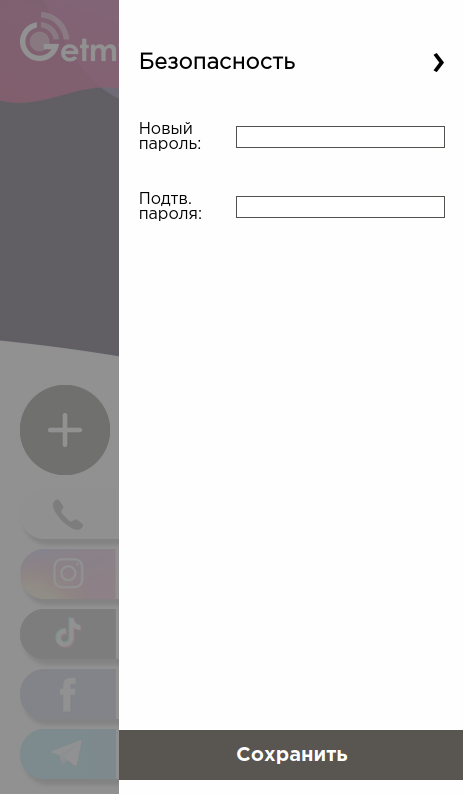
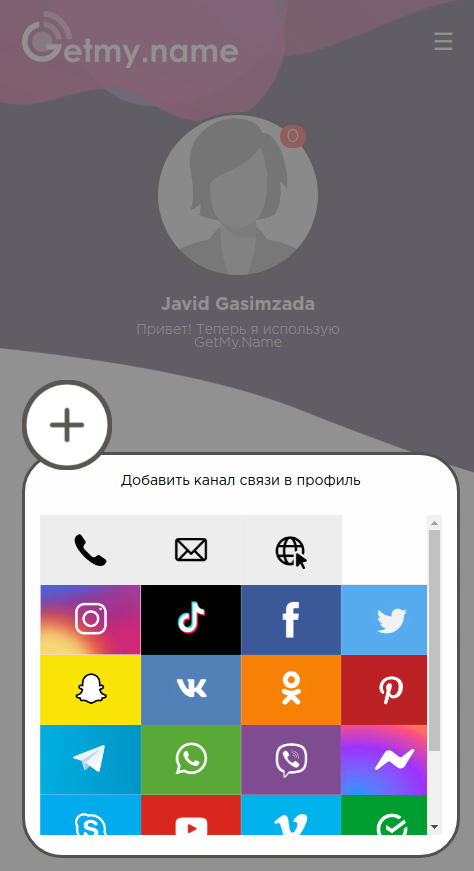
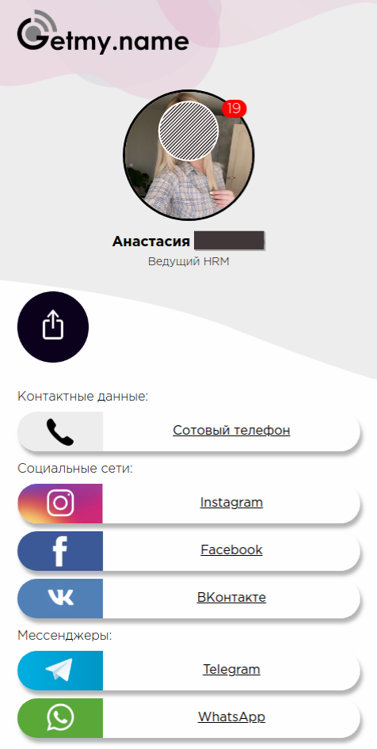

<h1 align=center>GetMyName</h1>

<h2 align=center>This is a commercial project</h2>
<h2 align=left>Front-End: PSD Layout to HTML, CSS, JS(JQuery)</h2>
<h2 align=left>Back-End: PHP(Lumen php framework), MySQL</h2>

 

<h1 align=center>What is realized</h1>
<h2 align=left>1. Registration by invitation</h2>
  <h3>Admin can specify a unique profile identifier for the link (e.g. avidim) instead of the automatically generated one (e.g. id54321)</h3>
  <h3>The user profile link will look like /profile/avidim or /profile/id54321 at the end</h3>
  
  
<h2 align=left>2. Profile activation by email</h2>
  <h3>After email input, the user needs to follow the link in the email to activate their profile</h3>
  
  
  
<h2 align=left>3. User profile</h2>
  <h3>After registration user page will include 5 predefined but not active links</h3>
  

  <h3>User menu</h3>
  

  <h3>User can change his avatar, name, surname, status and profile theme</h3>
  

  <h3>Password update menu</h3>
  

  <h3>User can add new social account link</h3>
  

  <h3>Those basic 5 links and every new link is not active by default, user have to edit (add account name) link in order to activate it</h3>
  

  <h3>Social account link deleting</h3>
  

<h2 align=left>4. How the user's profile looks like from the outside</h2>
  <h3>Clicking on any social link will take the viewer to that social account in a new tab</h3>
  