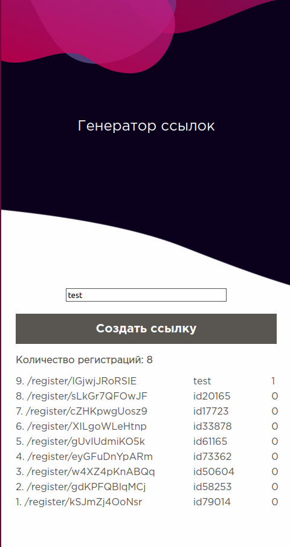

<h1 align=center>GetMyName</h1>

<h2 align=center>This is commercial project</h2>
<h2 align=left>Front-End: PSD Layout to HTML, CSS, JS(JQuery)</h2>
<h2 align=left>Back-End: PHP(Lumen php framework), MySQL</h2>

 

<h1 align=center>What is realized</h1>
<h2 align=left>1. Registration by invitation</h2>
  <h3>Admin can specify a unique profile identifier for the link (e.g. avidim) instead of the automatically generated one (e.g. id54321)</h3>
  
  

